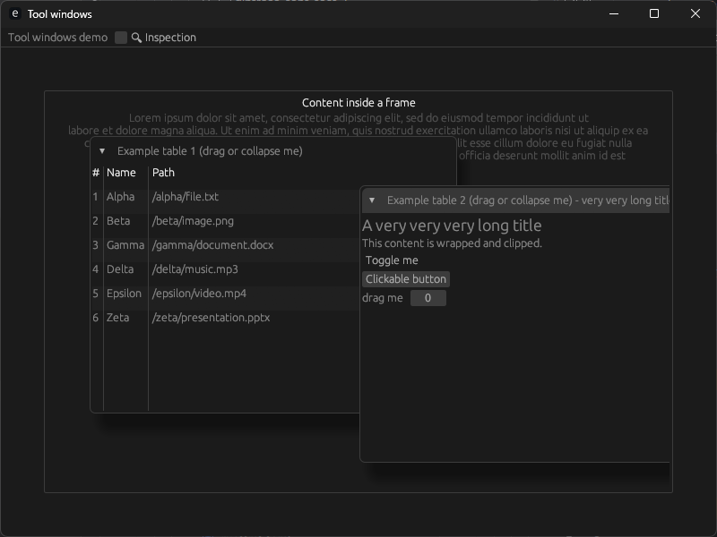

<div align="center">

[](https://github.com/makerpnp/egui_tool_windows/actions/workflows/rust.yml)
[](https://discord.gg/ffwj5rKZuf)
[](https://www.youtube.com/channel/UClzmlBRrChCJCXkY2h9GhBQ?sub_confirmation=1)
[](https://github.com/MakerPnP)
[](https://ko-fi.com/dominicclifton)
[](https://www.patreon.com/MakerPnP)

</div>

# egui_tool_windows

Floating tool windows for egui that can be used in containers, like resize, scroll-area, frame, etc.

* Simple API for adding multiple windows inside a container.
* Independent z-ordering, when clicked they are sent to the front.
* Collapsible.
* Resizable.
* Draggable.
* Floats on top of content.
* Constrained to the container.
* Clipped to the container.
* Tool windows are moved if the container is resized too small.

Regular egui::Window and egui::Area instances can be placed above them, they do no clash.

## Basic API usage

```rust
egui::ScrollArea::both()
    .auto_shrink([false, false])
    .scroll_bar_visibility(ScrollBarVisibility::AlwaysVisible)
    .show(ui, |ui|{

        ui.strong("Content inside a frame");
        
        ToolWindows::new()
            .windows(ui, |builder|{
                builder
                    .add_window("id_salt_1")
                    .show("Title 1".to_string(), |ui| {
                        ui.label("Tool window 1");
                    });

                builder
                    .add_window("id_salt_2")
                    .show("Title 2".to_string(), {
                        ui.label("Tool window 2");
                    });
            });
    });
```

You can call `ToolWindows::new()` as many times as you like, e.g. if you have multiple containers that each need their
own tool windows. 

## Status

This crate is work-in-progress, but usable, see below.

## Limitations

* The goal is to allow them to be used *inside* `egui::Area` and `egui::Window` instances, and by extension, with `egui_dock`
  windows that but this doesn't work, yet.  The content is present, but obscured.
* If one window obscures another, hovering of elements in the obscured window 'bleeds-though'.  e.g. if there's a table 
  with resizable columns obscured by another tool window, when you hover over the obscured column divider the mouse
  pointer changes and allows obscured columns to be resized, when it should not.
* Due to similar bleed-though of egui sense due to lack of z-ordering, non-top-most tool windows cannot be resized or
  dragged; you have to click the window first.  there are visual cues for top-most tool windows however.
  It's perfectly usable, but not ideal.

So currently, if what you want to put in tool windows isn't affected by the current limitations, then this is usable
right now for you.

Once the above issues are solved more attention will be given to additional planned features such as:
* additional API methods. 
* persistence.

## Demos

The crate contains 2 demos.

* `simple` - shows the current state and behavior of the tool windows when used in a container.
* `inside_windows` - attempts to use the tool windows inside `egui::Window` instances - doesn't currently work correctly.

Refer to the `demos` folder.

## Screenshot

Here's a recent screenshot of the `simple` demo:

[](assets/screenshots/screenshot_2025-06-28_024126.png)

## License

Available under APACHE *or* MIT licenses.

* [APACHE](LICENSE-APACHE)
* [MIT](LICENSE-MIT)

## Authors

* Dominic Clifton - Project founder and primary maintainer.

## Changelog

### 0.1.0

First release

### 0.1.1

 - Changed - Usability improvements.
 - New - Tool windows have visual shadows.
 - New - API improvements for `default_size` and `default_pos`.
 - Fixed - Not being able to bring a tool window to the front by clicking in its title-bar.  

## Timeline

2025/06/27 - Crate created!

## Links

* Patreon: https://www.patreon.com/MakerPnP
* Github: https://github.com/MakerPnP
* Discord: https://discord.gg/ffwj5rKZuf
* YouTube: https://www.youtube.com/@MakerPnP
* X/Twitter: https://x.com/MakerPicknPlace

## Contributing

If you'd like to contribute, please raise an issue or a PR on the github issue tracker, work-in-progress PRs are fine
to let us know you're working on something, and/or visit the discord server.  See the  section above.
